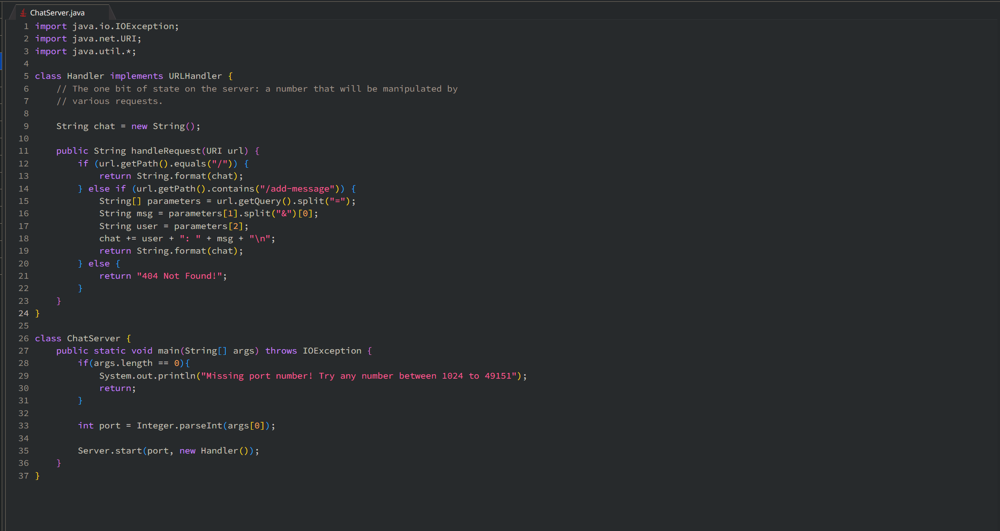
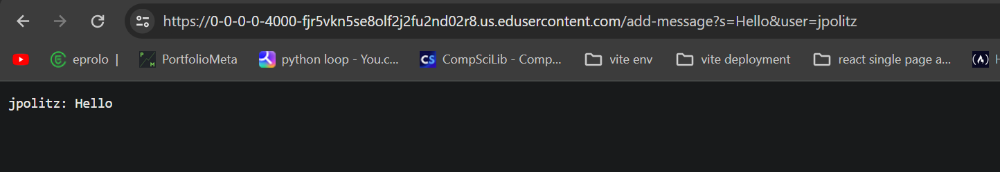
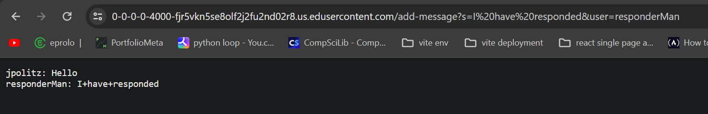
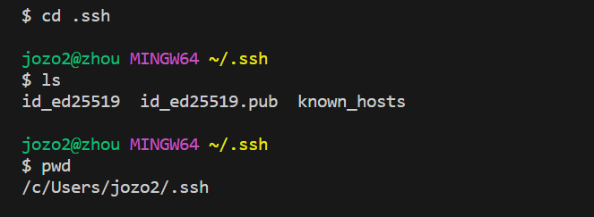
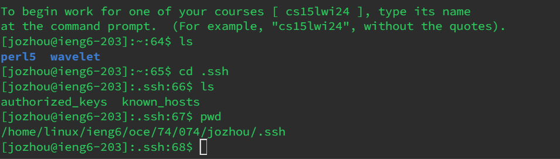
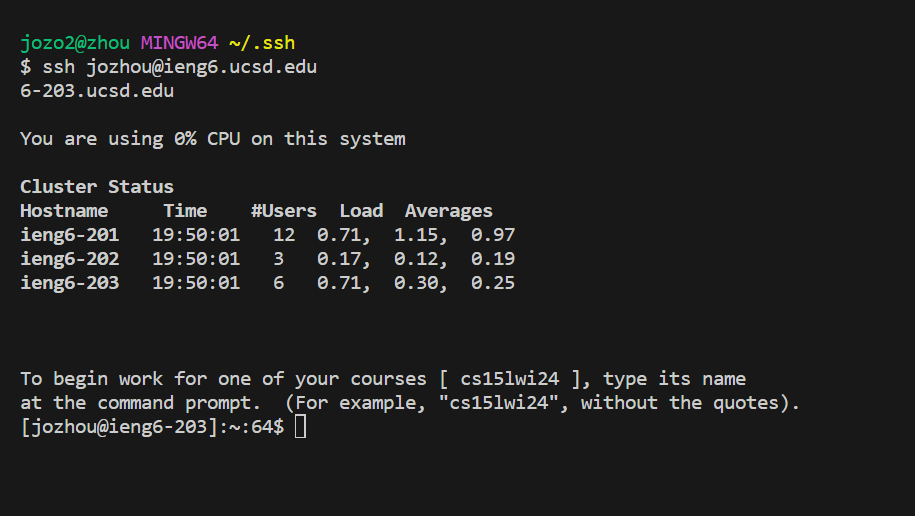

# **`CODE`**

# **`Chatter 1`**
---
* After the server is started, method `handleRequest` is called upon whenever the URL is changed
* In this case, `handleRequest` takes in a `URI` value designated `url`
* The values of Strings `msg` and `user` are important in storing the information taken from the url commands
* While not a part of the method, the String `chat` is a relevant field of the class, as it is where the history of the "chatting" is stored
* As `url` is passed into the method, it uses `.getPath` to extract the path inputted, and that path is read as such:
* If the path is simply `/` it displays the chat
* In this case, the query is `/add-message?s=Hello&user=jpolitz`
* If the path includes `/add-message` the path is then segmented by `=` into an Array of strings; the first element of the array includes the `add-message` command,
the second element includes the message, and the third element includes the user (`["add-message?s", "Hello&user", "jpolitz"]`). As the second element in the Array includes the message,
we extract the message by separating by `&` where the message is the the first element of the new Array (`["Hello", "user"]`); to which we assign to the String `msg` (`"Hello"`).
The third element of the first array includes the user, to which we assign to the String `user` (`"jpolitz"`)
* To produce the chat, we concatenate `user + ": " + msg + "\n"` to the String `chat` (`"jpolitz: Hello\n"`)(the `\n` is important in printing the chat across multiple lines)
* The chat is then returned to be displayed

# **`Chatter 2`**
---
* After the first call, additional calls with also call upon the `handleRequest` method, to which it will do the same thing
* The values of Strings `msg` and `user` are important in storing the information taken from the url commands
* While not a part of the method, the String `chat` is a relevant field of the class, as it is where the history of the "chatting" is stored
* As `url` is passed into the method, it uses `.getPath` to extract the path inputted, and that path is read as such:
* If the path is simply `/` it displays the chat
* In this case, the query is `/add-message?s=I have responded&user=responderMan` (because Java encodes whitespaces as `+`, the queries will replace whitespace with `+`)
* If the path includes `/add-message` the path is then segmented by `=` into an Array of strings; the first element of the array includes the `add-message` command,
the second element includes the message, and the third element includes the user (`["add-message?s", "I+have+responded&user", "responderMan"]`). As the second element in the Array includes the message,
we extract the message by separating by `&` where the message is the the first element of the new Array (`["I+have+responded", "user"]`); to which we assign to the String `msg` (`"I+have+responded"`).
The third element of the first array includes the user, to which we assign to the String `user` (`"responderMan`)
* Chat in this instance, already has the previous message baked into the string, to which we concatenate the new  `user + ": " + msg + "\n"` to the String `chat` (`"jpolitz: Hello\nresponderMan: I+have+responded\n"`)
* The chat is then returned to be displayed

# **`Part 2`**
*`Private Key`

*`Public Key`

*`Passwordless Login`

# **`Part 3`**
I learned a lot about specific Unix commands, as I wasn't too familiar with using the terminal before. I also learned about how URLs are handled and how I could read specific arguments from said URLS. Running a server through Java was also new to me, and I hadn't know I could choose my ports when I start a localhost. One big thing I learned was remote hosting, and I didn't know you could connect and move about remotely using Unix commands.
